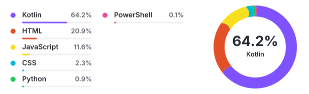
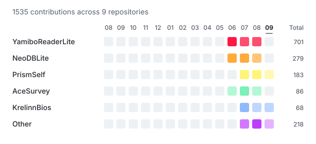

# 👋 Bios

### Independent Development · Useful Tools · Vibe Coding

把具体想法做成真正可用的工具与产品

## 📦 Projects

- [Outvalue](https://outvalue.lol/) — 按公开支持金额实时排序的排名站点
- [PrismSelf](https://github.com/KrelinnBios/PrismSelf) — 面向性别理论、心理概念与人际关系议题的中文知识库
- [NeoDBLite](https://github.com/KrelinnBios/NeoDBLite) — 面向 NeoDB 与兼容实例的非官方 Android 标记客户端
- [YamiboPlus](https://github.com/KrelinnBios/YamiboPlus) — 面向百合会论坛的非官方原生 Android 客户端

## 💻 Languages

  

## 📊 Contribution Focus

  

